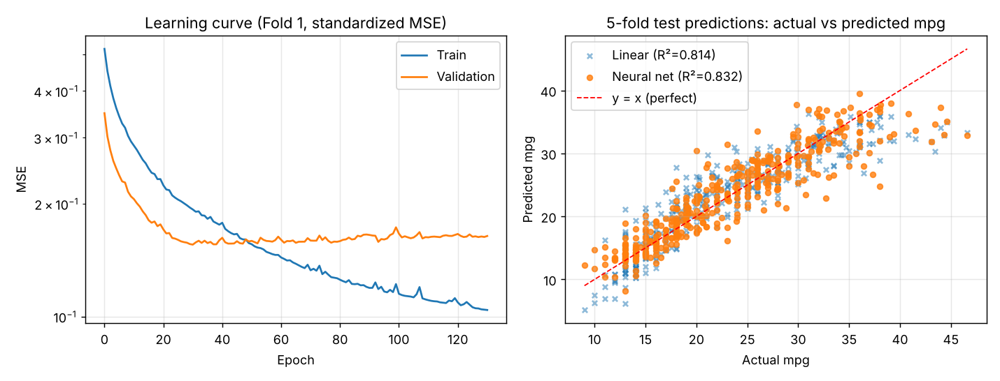

# 인공신경망 데이터 예측 실습

데이터처리개론 과제 — 공개 데이터(UCI Auto MPG)의 자동차 제원 9가지(실린더 수, 배기량, 마력, 무게, 가속, 연식, 제조 지역)로 **연비(mpg)** 를 예측하는 인공신경망(다층 퍼셉트론, MLP) 프로그램입니다.

## 웹사이트
`index.html` — **엑셀(.xlsx)이나 CSV 표를 올리면** 예측할 열과 입력 열을 골라 브라우저에서 신경망을 학습시키고, 다중 선형회귀와 비교하고, 새 값을 넣어 예측합니다.
- 엑셀에서 표를 복사해 붙여넣어도 됩니다. 시트가 여러 개면 시트를 고를 수 있습니다.
- 글자로 된 열(지역, 성별 등)은 자동으로 원-핫 인코딩합니다.
- 올린 파일은 브라우저 안에서만 읽고 어디에도 보내지 않습니다.
- 엑셀 읽기, 신경망, 그래프 모두 외부 라이브러리 없이 직접 구현했습니다.
- 시험용 엑셀 파일: `예제_자동차연비.xlsx`

## 모델
| 항목 | 내용 |
|---|---|
| 구조 | 입력 9 → 은닉층 16 (ReLU) → 은닉층 8 (ReLU) → 출력 1 |
| 학습 | 순전파 → MSE 손실 → 역전파 → 미니배치 경사하강법 |
| 과적합 방지 | L2 정규화, 조기 종료 |
| 구현 | 딥러닝 라이브러리 없이 numpy / JavaScript로 직접 구현 |

## 실행 방법 (Python)
```bash
pip install -r requirements.txt
python ann_predict.py
```
Google Colab에서는 `ann_predict.py` 내용을 셀에 붙여넣고 실행하면 됩니다.

## 결과 (5-겹 교차검증 평균)
| 모델 | R² | RMSE | MAE |
|---|---|---|---|
| 인공신경망 | 0.829 | 3.13 mpg | 2.30 mpg |
| 다중 선형회귀 | 0.810 | 3.35 mpg | 2.56 mpg |



## 데이터 출처
Quinlan, R. (1993). Auto MPG [Dataset]. UCI Machine Learning Repository.
